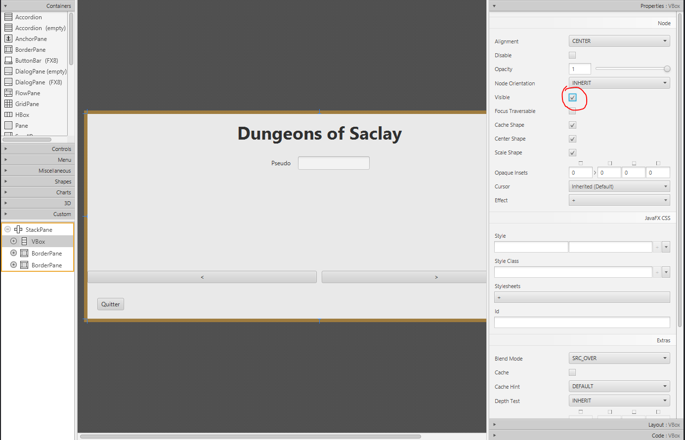

Interaction Humain-Machine @ Et3
Polytech Paris-Saclay | 2025-26

# TP noté 2

## Consignes générales

Pour ce TP noté, vous pouvez :
- utiliser vos anciens TP ainsi que leur correction.
- utiliser internet pour faire des recherches.

Vous ne pouvez pas :
- utiliser d'IA générative.


**$\text{\color{red}Avant de commencer ce TP}$, Désactivez les suggestions de complétion de votre IDE :**
- Sur Visual Studio Code : Dans les paramètres, aller dans _Chat -> Miscallenous_ et cocher "Disable AI Features"
- Sur IntelliJ : Dans les paramètres, aller dans _Editor -> General -> Inline Completion_ et décocher la première case.

## Description
*Dungeons of Saclay* est un jeu vidéo très attendu censé sortir aujourd'hui. Mais alors que vous recevez les fichiers du jeu pour les mettre en ligne, vous réalisez qu'il est incomplet. Vous avez 2h pour terminer le jeu avant sa sortie officielle. Vous devez obtenir un résultat similaire à celui montré dans la vidéo ci-dessous.

*Dungeons of Saclay* est un jeu vidéo de type RPG où l'on peut :
- choisir le nom de son héros et sa classe, qui ont des statistiques propres (Vie, Attaque et Défense).
- combattre des monstres aléatoires au tour par tour :
    - à chaque tour, on peut attaquer, utiliser l'attaque spéciale de se classe ou se défendre. 
    - puis c'est au monstre d'agir.
    - un historique garde la trace de tout ce qu'il s'est passé lors du combat.
    - à la fin du combat, on récupère des items.
- avant chaque combat, on peut accéder à son inventaire pour :
    - utiliser des items comme des potions.
    - équiper et déséquiper des armes et armures.
    - jeter des objets pour libérer de la place dans l'inventaire.

**Test du fonctionnement du jeu final terminé:**

https://github.com/user-attachments/assets/f5104603-8308-4747-87b1-e03a8b7dd5f6


## Structure du programme

Le programme utilise l'architecture MVC et contient les fichiers suivants :
- **View.java**  (correspond au contrôleur Javafx) : contient les déclarations des éléments graphiques définis dans le fichier fxml (avec SceneBuilder) et les fonctions de capture d'événements utilisés dans SceneBuilder
- **Controller.java** : contient les méthodes qui permettent d'interagir avec l'interface.
- **Model.java** : contient la logique de jeu et stocke les informations relatives à la partie. **Dans ce TP, vous n'avez pas à modifier cette classe.**
- Package _objet_ et _personnage_ : contiennent des classes fonctionnelles. **Dans ce TP, vous ne devez pas modifier les classes contenues dans ces packages.**

Vous ne devez pas tout comprendre sur ce programme, nous vous indiquerons quels fichiers modifier tout au long du TP.

L'interface graphique a été réalisée en utilisant SceneBuilder.
Vous avez accès au fichier fxml qui se trouve à l'emplacement suivant : ```src/main/resources/View.fxml```.
Dans ce TP, vous allez devoir modifier ce fichier fxml à l'aide de SceneBuilder.

Le fichier fxml décrit l'interface graphique qui consiste en un StackPane qui contient trois conteneurs (un pour chaque menu) :
- Menu principal : VBox
- Menu préparation : BorderPane
- Menu combat : BorderPane

Une StackPane permet d'empiler plusieurs autres conteneurs l'un sur l'autre. Lorsqu'on veut afficher un menu spécifique, on passe l'attribut _visible_ du conteneur associé à _true_ et ce même attribut à _false_ pour les autres conteneurs.

Pour afficher un des menus sur SceneBuilder, on commence par sélectionner le conteneur correpondant au menu (arborescence à gauche), puis on change l'attribut _visible_ (checkbox) dans le panel de Properties (à droite)  de SceneBuilder (voir image ci-dessous).



## Questions

Avant de commencer, faites tourner une première fois le squelette pour voir si l'application se lance bien et observer tout ce qui est manquant et ce que vous aurez à faire pendant le TP. Si il y a une erreur et que l'application ne se lance pas, appelez votre enseignant.

### Partie 1 : Menu principal

#### Afficher les statistiques des héros
1. Depuis SceneBuilder, ajoutez le panel permettant de voir les stats des héros disponibles comme dans l'exemple vidéo. 
Vous pouvez utiliser des _ProgressBar_ pour afficher les stats. 

2. Modifiez la fonction _selectHeros()_ du controller pour modifier les valeurs des _ProgressBar_ et afficher les stats de base d'un héros lorsqu'il est séléctionné.

> Note 1 : Les différents héros sont stockés dans le tableau accessible avec _Heros.values()_.
> Ainsi _Heros.values()[0].getNom()_ permet de récupérer le nom du premier héros de la liste des héros.

> Note 2 : Il est possible de modifier la valeur affichée d'une _ProgressBar_ en utilisant la méthode _setProgress()_ qui prend en entrée une valeur entre 0 et 1.
> Les stats des héros ont une valeur comprise entre 0 et 100.

#### Exiger un pseudo pour pouvoir commencer

3. Dans le programme incomplet, il est possible de commencer une partie sans avoir renseigné de pseudo.
Dans la view, en ajoutant un _listener_ sur la _textProperty_ du _TextField_ faites en sorte que :
 * Le bouton commencer est grisé et empêche de lancer la partie tant qu'il n'y a pas de texte dans le _TextField_.
 * Un message (représenté sous forme d'un _Label_) indique qu'il faut renseigner un pseudo, et devient invisible quand un pseudo est tapé.


### Partie 2 : Menu Préparation

#### Affichage des statistiques actuelles

1. Créez dans SceneBuilder l'affichage des statistiques actuelles du héros (comme dans la vidéo) dans le _BorderPane_ "Stats" 

2. Mettez à jour la méthode _updateStats()_ du contrôleur pour modifier les valeurs des _ProgressBar_ rajoutées à l'étape précédente.

> Note : Les stats actuelles sont différentes des stats de base. Les stats du héros actuel sont disponibles en utilisant les méthodes
_getVieMax()_, _getAttaqueActuelle()_ et _getDefenseActuelle()_ du héros actuel. Le héros actuel est accessible depuis la méthode _getHeros()_ du modèle.

#### Inventaire et Equipement

2. Depuis SceneBuilder, ajouter un GridPane (1 ligne,2 colonnes) dans l'élément CENTER du _BorderPane_ "Equipement" avec l'id (fx:id) _grid_equipement_. 

3. Depuis SceneBuilder, ajouter un ScrollPane dans l'élément CENTER du _BorderPane_ "Inventaire", qui va lui même contenir un GridPane (1 ligne,9 colonnes) avec l'id (fx:id) _grid_inventaire_.

> Note : Veillez à correctement entrer les fx:id, sans quoi la suite pourrait ne pas fonctionner.

Une fois que vous avez bien ajouté les éléments sur SceneBuilder avec les fx:id corrects :
* Décommentez les dernières lignes du fichier View.java (méthodes _initLabelObjetEquipement_ et _initLabelObjetInventaire_)
* Décommentez les dernières lignes du fichier Controller.java (méthodes _utiliserEquipement_ et _utiliserObjetMenu_ )

Assurez-vous d'avoir effectué ces modifications avant de passer à la question suivante.

4. Ecrire le corps de la méthode _afficherObjets()_ dans le controller qui :
- efface les elements de _grid_equipement_ et _grid_inventaire_ (ex : _grid_equipement.getChildren().clear()_)
- parcourt les équipements du heros actuel (model.getHeros().getEquipements() qui permet d'obtenir ArrayList contenant les Objets) et utilise la méthode _initLabelObjetEquipement(Objet o, int index_objet)_ de la view
  pour ajouter les objets (un à un) dans le GridPane _grid_equipement_.
- parcourt l'inventaire du heros (ArrayList model.getHeros().getInventaire() )
  et utilise la méthode _initLabelObjetInventaire(Objet o, int index_objet)_ de la view
  pour ajouter les objets (un à un) dans le GridPane _grid_inventaire_.

### Partie 3 : Menu de combat

#### Historique des actions du combat

1. Depuis SceneBuilder, ajouter un TextArea (non editable) afin d'afficher l'historique des actions.

2. Modifiez la méthode _updateCombatUI_ du contrôleur pour ajouter le texte des dernières actions dans le TextArea.

<!-- Le nombre d'actions effectuées au tour précédent est passé via le paramètre _int nb_action_. -->

> Note : La méthode _getHistorique()_ du modèle contient toutes les actions effectuées lors du combat.

#### Fenêtre de fin de combat.

3. Modifiez la méthode _updateCombatUI_ du controller pour ajouter un fenêtre de dialogue modale (Alert) qui affiche les récompenses (objets + xp gagnés) lorsque le combat est terminé : 

> Note 1 : la méthode _getLastRecompenseObjetCombat()_ du modèle permet de récupérer l'objet gagné (Objet) lors du dernier combat.

> Note 2 : la méthode _getLastRecompenseXpCombat()_ du modèle permet de récupérer les xp gagnés (int) lors du dernier combat.

> Note 3 : la méthode _isLevelUp()_ du modèle permet de savoir si on est passé au niveau supérieur (renvoie true) ou pas (renvoie false).

> Note 4 : la méthode _isGameOver()_ du modèle permet de savoir si on a perdu (renvoie true) ou gagné (renvoie false)

### Partie 4 : Bugs additionnels

Il reste encore quelques bugs (fonctionnels et graphiques) dans l'application.
Saurez-vous les trouver et les corriger ?

Précisez en commentaire au début de *Controller.java* lesquels vous avez identifiés.

### Bonus : Drag and Drop

Ajoutez la possibilité de gérer les objets de l'inventaire et de l'équipement en utilisant du drag and drop.
Attention, les Objet peuvent être soit :
   * des Consommable (une potion) qui ne peuvent être utilisés que sur le héros et ne peuvent pas être ajoutés dans l'équipement.
   * des Arme qui peuvent être placées dans l'inventaire ou l'équipement, mais pas être utilisées sur le héros.
Vous pouvez ajouter des éléments graphiques pour indiquer cela lors du drag and drop.  
___

**RENDU DU TP :**

Le TP devra être rendu sous la forme d'une archive zippée (.ZIP) contenant les sources (*i.e.* le dossier *src*) de votre projet. Cette archive sera envoyée à votre chargé de TP par mail avec le sujet "[TpNote2] Prénom NOM Groupe".
- Groupe 1 : jourdan.theo@protonmail.com
- Groupe 2 : leo.kulinski@universite-paris-saclay.fr
